# F9开工 · Workday Launcher

**中文** · [English](README.en.md)

> 按一下快捷键，把每天要开的软件和网页全部打开。纯 Windows 自带组件实现，**不用装 Python、不用装 .NET、不用管理员权限、不联网、不写注册表**，解压就能用。

一个给「每天开机都要重复同一套动作」的人准备的小工具：把微信、WPS、钉钉、ERP、后台、进货网站……全部列进清单，之后每次只要按一下 `F9`（可改），它们就按顺序自己开好。

一开始是为了帮一位开办公耗材实体店的朋友做的——他每天开店前要手动点十几个图标。现在它是通用的：**任何重复的"开机前戏"都能交给它。**

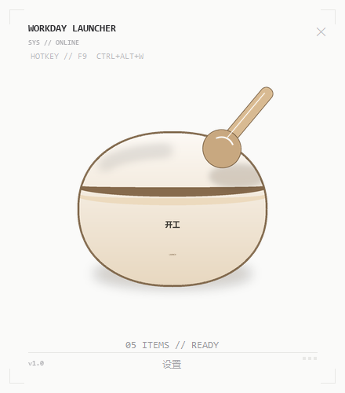

桌面图标双击出来的是这个 **启动台**：敲一下中间那只木鱼就开工（鼠标移上去木鱼会亮一点，
敲下去有回弹和一声"嗒"）。木鱼下面那行写的是你今天要开几项。**界面上就只有"开工"这一件事**，
别的都不摆在脸上。

---

## 目录

- [特色](#特色)
- [快速开始](#快速开始)
- [四套皮肤](#四套皮肤)
- [一键收工：关机 / 重启 / 睡眠](#一键收工关机--重启--睡眠)
- [开工彩蛋：飘自己的表情包 + 放自己的语音](#开工彩蛋)
- [它到底做了什么](#它到底做了什么)
- [文件说明](#文件说明)
- [常见问题](#常见问题)
- [自定义皮肤（进阶）](#自定义皮肤进阶)
- [开发 / 自检](#开发--自检)
- [License](#license)

---

## 特色

| | |
|---|---|
| **一个图标，一个动作** | 桌面只有**一个**「F9开工」图标。双击出来的是**启动台**——一只木鱼，敲一下就开工。界面上的状态行会告诉你今天要开几项。 |
| **设置藏在后面** | 要改清单 / 皮肤 / 彩蛋？开始菜单里的「F9开工 · 设置」，一个窗口全搞定（也可以双击程序文件夹里的 `设置.bat`）。启动台界面上刻意**只有"开工"这一个功能**。 |
| **热键静默开工** | 任何时候按 `F9` 或 `Ctrl+Alt+W`（默认两个都能用，可自定）立刻开工。**按下去 0.1 秒**右下角就浮出一个进度窗：进度条一直流动，开完一个走一格，全部开完停留几秒再自己收起。不抢焦点、不进任务栏、不打扰。 |
| **进度条不撒谎** | 条子会**一直流到软件的窗口真的出现在屏幕上**才收尾，中途写着 `正在启动 微信…（已等 12.4 秒）`。早先版本是"启动命令发出去了就算开完"——那个动作只要几十毫秒，于是条子 3 秒跑满收起，而微信在内存吃紧的老机器上还要 20 多秒才出来，看着像程序在骗人。**现在条子在右下角待多久，就是你那台机器真实的启动速度**；超过 30 秒没等到也会照实写"还有 N 项没看到窗口"，绝不无限转。 |
| **按键永远不卡** | 后台常驻进程**自己**就把活干完（早先版本是"再起一个子进程"，那样每次都要付 2~8 秒的 PowerShell 冷启动，按下去半天没动静）。现在从"按下"到"第一个软件真的出来"实测 0.1~0.2 秒。配合 1.5 秒防重复，也不会手抖连按把软件开两遍。 |
| **同一个东西不重复打开** | 三重保险：手抖连按只认第一下；**软件已经开着就跳过**（不会冒出第二个微信/第二个编辑器），并把它已经开着的窗口**叫到最前面**——所以按下去屏幕上总有反应；清单里填重了的只开一次。想每次都硬开一遍就把 `skipIfRunning` 设成 `false`，想只跳过不动窗口就设 `activateIfRunning: false`。 |
| **一键收工** | 按 `Ctrl+Alt+Q` 弹出**关机 / 重启 / 睡眠**三选一，**默认等 60 秒**才真的执行 —— 这段时间里点【取消】、按 Esc、点右上角那个 × 都能立刻停下，什么都不会发生。关机刻意**不加 `/f`**，行为跟开始菜单里的「关机」完全一致（有没保存的文档时 Windows 会照常问你）。想让某个动作别出现，在控制面板里取消勾选即可。 |
| **后台会自愈** | 后台待命进程万一没在跑（比如只是锁屏解锁、没真正登录），双击一下桌面图标就会自动把它拉起来，状态栏会告诉你「已自动帮你启动」。 |
| **四套简约皮肤** | 简约白 / 墨玉黑 / 莫兰迪 / 深海靛。下拉框一选**当场生效**，桌面图标也跟着换成同色系，不用重开。 |
| **开工彩蛋** | 开工时可以在屏幕上飘一张你自己的表情包，并放一段你录的语音（或让系统语音念一句话）。 |
| **界面中英双语** | 设置界面右上角一键切换中文 / English。 |
| **零依赖零安装** | 只用 Windows 自带的 PowerShell 5.1 + WinForms，不装任何运行库。 |
| **不联网、不上报** | 全程本地运行，没有任何网络请求。清单和设置就是文件夹里一个 `config.json`，随时可以看、可以删。 |
| **随时卸载** | 双击 `uninstall.bat` 就干净了：删快捷方式、关后台、去掉开机自启，文件夹留着你自己处理。 |

---

## 快速开始

**要求**：Windows 10 / 11（自带 PowerShell 5.1 即可）。

1. 下载这个仓库（`Code` → `Download ZIP`），解压到任意目录，例如 `D:\WorkdayLauncher`
   > ⚠️ 路径里**可以有中文，但不要放在** `C:\Program Files` 这类需要管理员权限的目录。
2. 双击 **`install.bat`**
3. 桌面上会出现一个「F9开工」图标
4. 打开设置：**开始菜单里搜「F9开工」→ 点「F9开工 · 设置」**（或者双击程序文件夹里的 `设置.bat`）
5. 在 ① 里勾选要打开的软件（点【添加软件】可以浏览选择），在 ② 里粘贴要打开的网址
6. 点右下角 **【保存并生效】**
7. 之后每天：**按一下 `F9` 或 `Ctrl+Alt+W`** —— 开工。
   不想起手翻键盘？**双击桌面图标 → 敲一下中间那只木鱼**，一样的效果。
8. 下班前：**按一下 `Ctrl+Alt+Q`** —— 关机 / 重启 / 睡眠，带倒计时，随时能反悔。

「③ 其它设置」这一组长这样（鼠标停在任何一项上都有说明）：

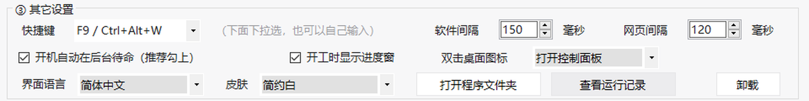

---

## 四套皮肤

下拉框选完立刻生效，桌面图标也会跟着换。

| 简约白（默认） | 墨玉黑 |
|---|---|
| 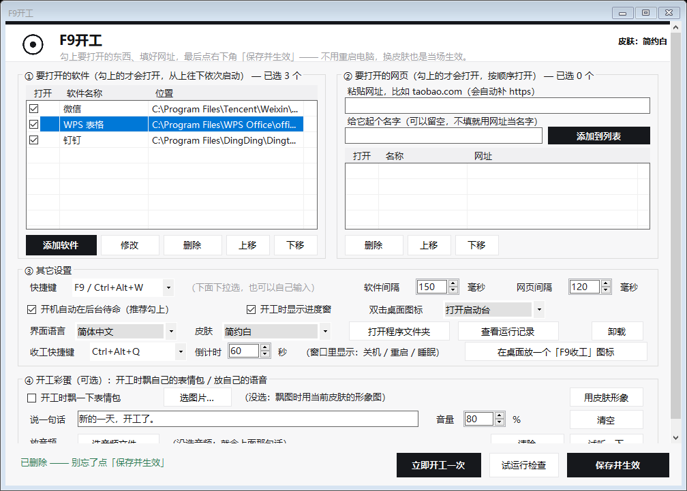 | 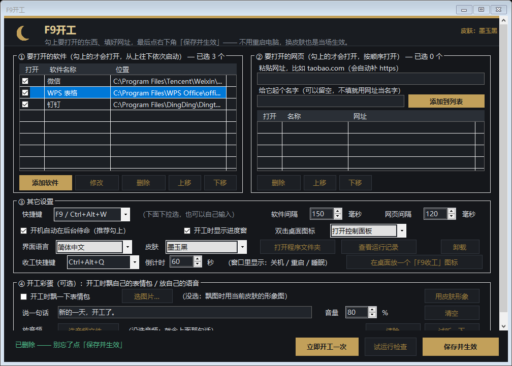 |

| 莫兰迪 | 深海靛 |
|---|---|
| 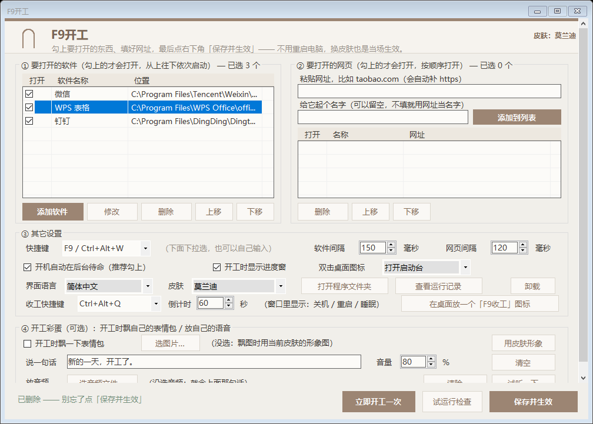 | 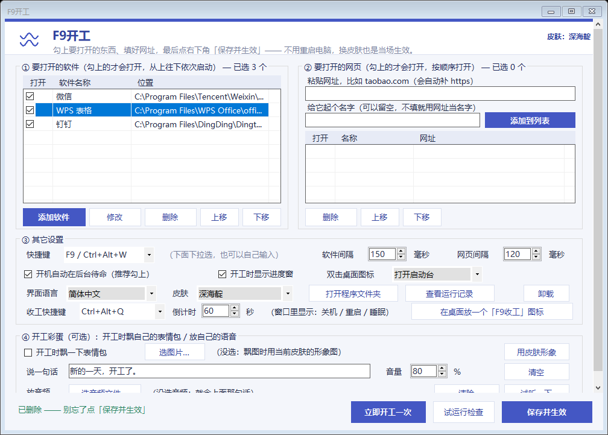 |

开工时右下角浮出的**进度窗**也吃同一套配色（左：进行中 / 右：完成，清单会列出来）：

| 简约白 | 墨玉黑 |
|---|---|
| 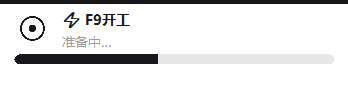 |  |
| 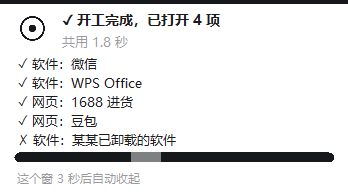 | 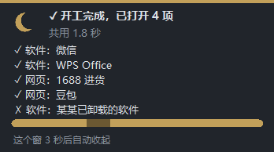 |

换皮肤有两个入口，随便哪个都行：

- 控制面板里 ③ 其它设置 → **皮肤** 下拉框
- 双击文件夹里的 `换皮肤.bat`（命令行里选）

---

## 一键收工：关机 / 重启 / 睡眠

下班的时候不用再去找开始菜单 —— 按 `Ctrl+Alt+Q`：

| 选动作 | 倒数 |
|---|---|
| 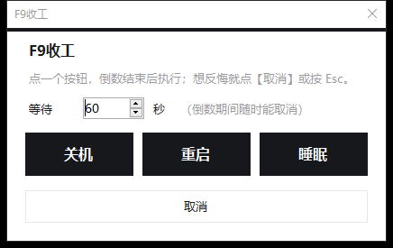 |  |

- 先选**等多少秒**（默认 60，可改 5~600），再点 关机 / 重启 / 睡眠。
- 点完窗口就翻成一个**大数字**，一秒减一下，**数到 0 才真的执行**。
  中途反悔：点【取消】、按 `Esc`、点右上角 × —— 三种都能立刻停下，什么都不会发生。
- 看到数字在跳就说明还没执行，**你有一整分钟可以改主意**。
- 关机**不带 `/f`**：有没保存的文档时，Windows 会像平时那样问你要不要保存，不会硬关。
- 「睡眠」这一项：如果系统开着**休眠**（Win10/11 为了快速启动默认就开着），
  这条命令实际会走进休眠 —— 一样省电，下次开机还更快，不是按错了。
- 英文界面下同样可用：

| Pick an action | Countdown |
|---|---|
| 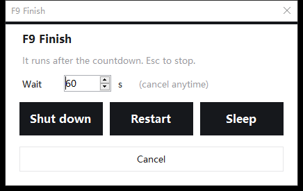 | 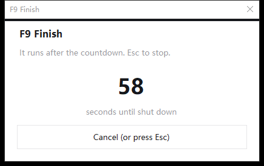 |

**它跟开工是两条独立的路**：`Ctrl+Alt+Q` 由后台那个常驻进程接收；
而程序目录里的 `run-quit.vbs`（以及命令行 `-Shutdown`）是**另起一个进程**去弹窗 ——
所以**后台没在跑、甚至被关掉了，这条路照样能用**。

不想要了怎么办：

- 只想去掉快捷键 → 控制面板里把「收工快捷键」那一格**清空**，保存并生效。
- 想彻底不要 → 清空快捷键就够了，程序不会再拦任何关机动作，也不会留图标或后台。
- 只想留一两个动作 → 三个动作默认都显示（在 `config.json` 的 `shutdownActions` 里可以裁）；
  不想要的话把 `config.json` 里的 `shutdownActions` 改掉，例如只留 `["shutdown"]`。

---

## 开工彩蛋

在控制面板的「④ 开工彩蛋」里可以设：

| 项目 | 说明 |
|---|---|
| **开工时飘一下表情包** | 勾上后，开工时屏幕右上角会有一张表情包从上面滑下来、停一下、淡出。可以选自己的图（png / jpg / bmp / gif，gif 只动第一帧）；不选就用当前皮肤的形象图。 |
| **说一句话** | 打一句话，开工时让 Windows 自带的语音念出来。中文也能念，不用装任何东西。 |
| **放音频** | 选一段自己的音频（wav / mp3 / wma / m4a）。**优先级比上面那句话高**——选了音频就放音频，不再念那句话。 |
| **音量** | 系统语音的音量 0-100（音频文件走系统音量）。 |
| **试听一下** | 立刻演一遍：飘一次表情包 + 放一次语音。不会打开任何软件。 |

> 想录自己的声音当"开工语音"？用手机录一段 m4a，或者用系统「录音机」录个 wav，放进 `音频` 里就行。

---

## 它到底做了什么

- **全局热键**：脚本常驻在后台，用 `RegisterHotKey` 抢全局快捷键（默认 `F9` 和 `Ctrl+Alt+W` 两个都能用）。
  一个格子里可以写多个（用 `/` 分开）。如果按键跟别的软件撞了，控制面板里换一个即可。
  > 单键（`F9`）会被本工具**全局吞掉**，在 Excel 里按 F9 就不再是重算公式了；所以默认额外留了一个 `Ctrl+Alt+W`。
- **按键不会被卡住（异步开工）**：后台那个常驻进程收到 `WM_HOTKEY` 之后，
  **先把进度窗亮出来**（实测**按下去 30~80 毫秒**窗口就出现），再去读配置、排清单、一项一项开。
  每一步之间都会泵一次消息，所以进度条在整个开工过程中是**连续流动**的，不会一格一格地顿。
- **为什么进度窗排在"排清单"前面**：从"按下"到"窗口出现"这段时间就是用户感觉到的响应速度。
  排清单要读一遍配置、挨个查软件路径、再写几条日志，实测 200 多毫秒；
  让它排在窗口前面，那 200 多毫秒就白白变成"按下去没动静"。
- **"开机后第一次按"为什么也一样快**：PowerShell 的函数体是**第一次调用时才编译**的，
  不预热的话第一次按键会平白多花 300 多毫秒（实测冷态 338 ms vs 热态 23 ms），
  而且正好砸在"开机后第一次按"那一下 —— 用户多半就是拿它来判断快不快。
  所以后台刚启动时会把这条路上的函数**空跑一遍**（不显示窗口、不写日志、不开任何软件），
  把这笔开销提前付在高频路径之外。
- **为什么不用子进程干这个活**：早先版本是"后台起一个新 PowerShell 子进程去开软件"。
  那样确实不会卡住消息循环，但代价是每次按键都要付一次 PowerShell 冷启动 ——
  实测**空脚本**的 `powershell.exe` 冷启动就要 5.9 秒（杀毒软件扫描占大头），
  叠加脚本编译后"按下 → 第一个软件真的出来"要 12.6 秒。现在后台直接干，全程 0.1~0.2 秒。
  代价是干活期间（约 1 秒）后台被占住、听不见按键 —— 用 1.5 秒防重复一并挡住了。
- **编译结果缓存到磁盘**：进度窗要用的那个 `NoFocusForm` 是 C# 内联编译出来的。
  `Add-Type` 每次都现场拉 `csc.exe` 编译要 2~7 秒，所以编一次就把 dll 存到 `cache/` 目录
  （文件名带源码的 SHA256，源码改了自动重新编），下次直接 `LoadFrom`。
- **进度条为什么不用自绘**：高光是"填充 Panel 里再套一个高光 Panel，每帧只改它的 `Left`"。
  第一版是在 `Paint` 事件里用 `SetClip` + `LinearGradientBrush` 画的 ——
  GDI+ 这两个操作极贵，而且每帧都要进一次脚本引擎，实测一次重绘卡 1 秒以上，
  把"每个软件之间等 400 毫秒"硬生生拖成 2.8 秒。现在没有任何自绘代码，重绘全交给系统。
- **按顺序启动**：先按 ① 的顺序启动软件，再按 ② 的顺序打开网页，中间有可调的间隔
  （默认软件间隔 **150 ms**、网页间隔 **120 ms**）。间隔只用在"开下一个之前"——
  第一个软件是**零延迟**立刻打开的，最后一个也不用白等收尾。
  这两个数直接乘进总时长（3 个软件就是 2 个间隔），所以默认给得很小；设 0 = 一口气全点出去。
- **防重复触发**：1.5 秒内按第二次会被忽略（避免手抖连按，或两个快捷键一起按，把同一批软件开两遍）。
- **同一个东西绝不重复打开（三重保险）**：
  ① 手抖连按 / 两个快捷键一起按 → 1.5 秒时间闸 + `LaunchBusy` 只认第一下；
  ② **软件已经在跑**（微信本来就开着）→ 开之前先看进程表（拿 exe 文件名比进程名），
     不会冒出第二个进程，而是**把它已经开着的窗口叫到最前面**（最小化的先还原），
     进度窗里会写成 `· 软件：微信（本来就在运行，已把它叫到最前面）`；
     ⚠️ **"只跳过、不做任何动静"是个陷阱**：三个软件全开着时，按快捷键屏幕上什么都不会变
     （只有右下角小条自己亮一下），用户的结论就是"按了没反应 / 程序坏了"。
     所以跳过必须伴随一次"把窗口摆到他眼前"。抢前台是四级递进、每级都真去核对
     前台窗口是否已变成它（Windows 有"前台锁"，不是当前前台的进程会被直接忽略）：
     直接叫 → 接线程（`AttachThreadInput`）→ 按一下 Alt 解锁 → `SwitchToThisWindow`。
     最后再把清单里**第一个**软件重叫一次，让它留在最上层（否则最上层那个是随机的）。
  ③ **清单里填重了**（同一个 exe / 同一个网址出现两次）→ 排清单时按 `exe 全路径` / `url` 去重，只开第一次。
  想把 ② 关掉（比如希望每次都把已开着的窗口再拉起来），把 `skipIfRunning` 设成 `false`；
  想保留"跳过"但不要"动窗口"（怕抢输入焦点），把 `activateIfRunning` 设成 `false`。
  查"在不在跑"用的是 `[Process]::GetProcessesByName(exe 文件名)` —— 过滤在原生代码里做，
  热态 10~40 ms，而且每次都是最新的（**故意不加缓存**：缓存太旧会把刚开过的又开一遍）。
  想知道这个开关当前是什么状态、哪些软件这轮会被跳过，跑一次自检（`自检.bat`）即可，
  输出里会有一行：`不重复打开: 开 —— 已经在运行的会跳过…；现在开着的有: 微信、WorkBuddy（开工时直接跳过）`。
- **找不到就告诉你**：某个软件被卸载了 / 路径变了，进度窗收尾时会单独列出来，并提示你可以在设置里删掉。
- **开机自动待命**：安装时会在「启动」文件夹里放一个 `.vbs` 静默拉起后台程序（不用管理员权限、不写注册表）。不想要了就在控制面板里取消勾选「开机自动在后台待命」。
- **黑色控制台窗口？没有**：桌面图标走 `wscript.exe` 拉起 `.vbs`（窗口模式 0），脚本内部还会再兜一次底把自己那个控制台隐藏掉——双击图标不会闪黑框。

---

## 文件说明

```
workday-launcher/
├── install.bat            安装（双击这个）—— 建桌面图标 + 设开机自启 + 拉起后台
├── uninstall.bat          卸载（双击这个）
├── 设置.bat               打开控制面板（不想用桌面图标时用）
├── 自检.bat               一键自检：查语法、查快捷键、查路径，不开任何东西
├── 换皮肤.bat             命令行换皮肤
├── check.bat              查快捷键 + 配置 + 日志（英文界面，给排错用）
├── dryrun.bat             试运行：只打印"将会打开什么"，真的不打开
├── edit-config.bat        用记事本直接打开 config.json（手改党用）
│
├── Start-Workday.ps1      主程序：热键常驻 / 开工序列 / 右下角进度窗 / 飘图 / 语音
├── Settings-GUI.ps1       控制面板（WinForms 界面）
├── Install.ps1            安装逻辑
├── Uninstall.ps1          卸载逻辑
├── Change-Skin.ps1        换皮肤逻辑
│
├── skin.json              皮肤配色（四套调色板 + 当前选中哪套）
├── art/                   皮肤装饰图 + 启动台的美术资源（muyu_*.png / muyu_tap.wav）
├── hub.ico                桌面「F9开工」图标的图案（一只木鱼）
├── run-app.vbs            打开控制面板用的静默启动器（零黑框）※安装时自动生成，不在仓库里
├── run-hub.vbs            桌面图标（启动台）用的静默启动器（零黑框）※安装时自动生成
├── run-quit.vbs           收工窗口用的静默启动器（零黑框）※安装时自动生成
├── skin_*_app.ico         各皮肤对应的桌面图标
├── skin_*_setup.ico       各皮肤对应的设置图标
├── quit.ico / skin_*_quit.ico   收工窗口用的图标
│
├── config.sample.json     配置模板（安装后会生成 config.json）
├── screenshots/           README 用的截图
└── logs/                  运行日志（自动生成，可以随时删）
```

配置文件 `config.json` 长这样（**这是唯一需要备份的文件**）：

```jsonc
{
  "hotkeys": ["F9", "Ctrl+Alt+W"],// 全局快捷键，几个都能用；一格写多个用 "/" 分开也行
  "shutdownHotkey": "Ctrl+Alt+Q", // 收工快捷键。写空字符串 = 关掉收工功能(想恢复默认就把这一行删掉)
  "shutdownSeconds": 60,          // 收工倒计时秒数(5~600)：点了按钮之后等这么久才真的执行
  "shutdownActions": ["shutdown", "restart", "sleep"], // 收工窗口里显示哪几个按钮
  "delayAfterAppMs": 150,         // 开下一个软件之前等多少毫秒(第一个/最后一个都不等；0=一口气全开)
  "delayAfterUrlMs": 120,         // 开下一个网页之前等多少毫秒
  "skipIfRunning": true,          // true=同一个东西不重复打开(软件已在运行就跳过；清单填重了也只开一次)
  "activateIfRunning": true,      // true=已在运行的软件不开第二个，而是把它的窗口叫到最前面(屏幕上一定有反应)
  "showTipAfterRun": true,        // 开工时右下角出不出那个进度窗
  "showHeartOnRun": true,         // 开工时飘不飘表情包
  "stickerPath": "art/ring.png",  // 自定义表情包；留空=用皮肤形象图
  "sayText": "开工啦，今天也要加油", // 让系统语音念这句话
  "soundPath": "",                // 或放一段音频（优先级更高）
  "voiceVolume": 80,
  "lang": "zh",                   // zh / en
  "iconAction": "panel",          // 双击桌面图标干什么：panel=弹出启动台(点中间木鱼才开工) / run=跳过启动台，一步直接开工
  "apps": [
    { "name": "微信", "path": "C:\\Program Files\\Tencent\\Weixin\\Weixin.exe" }
  ],
  "urls": [
    { "name": "进货", "url": "https://www.1688.com" }
  ],
  "browsers": {
    "edge": "C:\\Program Files (x86)\\Microsoft\\Edge\\Application\\msedge.exe"
  }
}
```

想临时停用某一项，不用删，加 `"enabled": false` 即可。

---

## 常见问题

**Q：Windows 提示"已保护你的电脑" / SmartScreen 拦截怎么办？**
A：这是没买代码签名的 `.bat`/`.ps1` 都会遇到的。点「更多信息」→「仍要运行」。所有代码都在仓库里，可以直接看。

**Q：下载 ZIP 解压后，双击 `install.bat` 说"文件已被阻止" / 一直弹确认框？**
A：那是从网上下载的文件自带的「Internet 标记」（Mark-of-the-Web），不是文件坏了。最干净的做法是先解除锁定：
```powershell
Get-ChildItem -Path . -Recurse | Unblock-File
```
或者更省事：**解压之前**先右键那个 ZIP → 属性 → 勾上「解除锁定」→ 确定，这样解压出来的文件都不带标记。
（点「仍要运行」当然也能过，只是每个文件都要点一次。）

**Q：先看代码再决定要不要用？**
A：应该的。几个检查点：① 代码里搜 `HttpClient`、`Invoke-WebRequest`、`WebClient` 是搜不到的——**全程没有任何网络请求**；
② `config.json` 和 `logs/` 都在 `.gitignore` 里，不会被提交；③ `Start-Workday.ps1 -Check` 是只读自检，什么都不改，可以先跑它。

**Q：双击图标还是闪了一下黑框？**
A：先跑一次 `install.bat` 让快捷方式刷新到最新（老版本装过的快捷方式参数是旧的）。脚本内部也会兜底隐藏控制台。如果还有，请提 Issue 并附上 `logs/launcher-*.log`。

**Q：双击图标弹出 `Windows Script Host`，说 `语句未结束`、错误代码 `800A0401`、指向 `run-app.vbs`？**
A：说明 `run-app.vbs` 被改坏了，或用了旧版本生成的。**跑一次 `install.bat` 就会自动重建并校验**。
根因是 VBScript 里字符串内部的引号必须写成两个（`""`），只写一个会把字符串提前截断。所以这个文件
不要手改；`Install.ps1` 生成后还会让 VBScript 引擎亲自编译一遍，不通过就自动退回不依赖 `.vbs` 的方式。

**Q：按 `F9` 没反应？**
A：① 最常见的原因是**后台待命进程没在跑**。它只在"真正登录"时由「启动」文件夹拉起 ——
如果只是锁屏再解锁、或者被误关了，它就不会自己回来。
**双击一下桌面图标就行**：现在打开控制面板时会自动检测，发现没在跑就当场拉起来，
状态栏会显示「后台刚才没在运行，已经自动帮你启动了」。也可以点【保存并生效】。
② 可能是按键被别的软件占了（单键 `F9` 尤其容易），换个键位，或者列表里保留一个 `Ctrl+Alt+W`。

**Q：按了快捷键，要等一两秒才有反应 / 感觉慢？**
A：分两段看：
- **程序响应**是瞬时的 —— 按下去右下角立刻浮出进度窗，实测**按下去 30~80 毫秒**窗口就出来了
  （后台常驻进程把按键路径的代码都提前"热"好了，所以**开机后第一次按也一样快**）。
- **后面那段是系统在启动软件**：`Start-Process` 交给 Windows 去拉起程序，然后每个软件之间按
  `delayAfterAppMs` 间隔（默认 150 ms）依次打开。
  想让软件几乎同时弹出，把「③ 其它设置」里的间隔调到 `0` 即可（调太小偶尔会有软件抢焦点）。
- 想自己量一下"按键那一下到底卡不卡"，跑：
  ```
  powershell -NoProfile -ExecutionPolicy Bypass -File Start-Workday.ps1 -SimTrigger
  ```
  它会走一遍按键流程并把「处理这一次按键: XX ms」写进日志（不按真键、不开任何窗口）。

**Q：进度窗还开着的时候再按快捷键，有用吗？**
A：开工那 1 秒左右后台是被占住的（它正在自己开软件，这样才快），这段时间里按键会被记成"上一次还没跑完，这次忽略"，
写进日志。1.5 秒防重复也是同一个道理。等这次开完（进度窗还在停着显示清单的那几秒）再按就正常了 ——
那几秒里后台是空闲的，随时能开工。

**Q：进度窗明明还开着（写着"正在启动 微信…"），这时候再按快捷键会怎么样？**
A：从 2026-09-24 起，"等窗口出现"这件事**不再占住后台** —— 它是交给进度窗自己的定时器（40 毫秒一跳）
慢慢看的，后台随时听得到按键。所以再按一次会正常开工：
已经在跑的软件被进程闸挡住（不会冒出第二个微信），只是进度窗会重来一遍。
**"同一个东西绝不重复打开"这条保证始终成立**，因为拦它的是进程检查，不是时间闸。

**Q：为什么微信要 20 多秒才出来，是这程序的问题吗？**
A：不是。拿四台"启动方式"在记事本上做过对照：`Process.Start` 直启、ShellExecute、
走 `explorer.exe`（等同双击）、`Start-Process`，**这程序用的那条是最快的**（出窗口 609 ms，
双击那条反而 3617 ms）。真正的瓶颈是机器：2012 年的 i5-3210M（双核）+ 8 GB 内存，
按下快捷键那一刻可用内存只剩 0.7~0.9 GB，Windows 已经在用页面文件（1.65 GB），
微信在这种状态下冷启动就必须一边换页一边加载 —— 硬盘还是块固态盘，没拖后腿。
最管用的改善是给内存腾地方（别让浏览器/夸克这些开机自启），而不是改这个程序。
想自己确认慢在谁身上：看日志里的 `窗口出现: 微信 -> 24310 ms`。

**Q：为什么改了默认间隔？**
A：间隔是"开下一个之前等多久"，N 个软件就有 N-1 个间隔，全都加在总耗时上。
以前默认 400 ms，3 个软件就白等 0.8 秒。现在默认 150 ms，够 Windows 把上一个进程登记好了。
如果你的机器上几个软件会互相抢焦点，在控制面板里调大一点即可；想最快就设 0。

**Q：提示"有 N 项没找到"？**
A：那个软件被卸载 / 挪位置了。在控制面板里点【修改】重新选路径，或点【删除】移除。

**Q：想让某些软件以管理员身份启动？**
A：Windows 不允许普通程序静默提权。把快捷方式放进清单是行不通的（UAC 会弹窗）。这类程序建议单独处理。

**Q：中文语音念得很怪 / 念不出来？**
A：系统里没装中文语音包。`设置 → 时间和语言 → 语音` 里加一个中文语音即可。控制面板的【试运行检查】会告诉你系统里有没有中文嗓子。

**Q：会联网吗？会上报我的清单吗？**
A：不会。全程本地运行，代码里没有任何网络请求，清单只存在你自己电脑上的 `config.json` 里。

---

## 自定义皮肤（进阶）

皮肤全在 `skin.json` 里，一个皮肤就是一组颜色：

```jsonc
{
  "skin": "minimal",                     // 当前用哪套
  "skins": {
    "minimal": {
      "label": "简约白",
      "labelEn": "Minimal",
      "art": "ring",                     // 用 art/ring.png 当形象图
      "bg": "#F7F7F8", "panel": "#FFFFFF", "card": "#FFFFFF", "border": "#E4E4E7",
      "headerBg": "#FFFFFF", "headerText": "#111113", "titleText": "#111113",
      "subText": "#6E6E76", "text": "#111113",
      "accent": "#16161A", "accentDark": "#000000", "accentText": "#FFFFFF",
      "listBg": "#FFFFFF", "listText": "#1C1C1E",
      "listGrid": "#F0F0F2", "listSelBg": "#E8E8EC", "listSelText": "#111113"
    }
  }
}
```

复制一份改颜色、改个名字就行。形象图放在 `art/`，256×256 透明 PNG 效果最好。

> 换完皮肤记得重新跑一次 `install.bat`，桌面图标才会换成对应的 `.ico`。

---

## 开发 / 自检

所有验收都在无头模式下跑，不会弹窗、不会截你的屏：

```powershell
# 控制面板内部自检（配色 / 翻译 / 开关往返 / 配置读写）
powershell -NoProfile -ExecutionPolicy Bypass -File .\Settings-GUI.ps1 -SelfTest
# 结果写到 logs\gui-selftest.txt

# 启动器自检（快捷键 / 配置 / 软件路径 / 皮肤 / 语音，什么都不打开）
powershell -NoProfile -ExecutionPolicy Bypass -File .\Start-Workday.ps1 -Check

# 试运行：只打印会打开什么
powershell -NoProfile -ExecutionPolicy Bypass -File .\Start-Workday.ps1 -DryRun

# 只看开工彩蛋（飘图 + 语音），不打开软件
powershell -NoProfile -ExecutionPolicy Bypass -File .\Start-Workday.ps1 -FanTest

# 模拟按一次快捷键（不按真键），并报出「处理这一次按键花了多少毫秒」
powershell -NoProfile -ExecutionPolicy Bypass -File .\Start-Workday.ps1 -SimTrigger

# 只演一遍收工窗口，绝不真的关机（点【取消】退出）
powershell -NoProfile -ExecutionPolicy Bypass -File .\Start-Workday.ps1 -QuitTest

# 把收工窗口离屏渲染成两张预览图（不弹窗、不截屏）
powershell -NoProfile -ExecutionPolicy Bypass -File .\Start-Workday.ps1 -QuitShot .\out
```

或者直接双击 `自检.bat`。

### 改代码时要注意的坑

- 所有 `.ps1` 必须是 **UTF-8 with BOM + CRLF**，否则 PowerShell 5.1 会把它当 ANSI 读，中文全乱、甚至误解析。
- **计时器 / 事件回调里的计数器一定要写 `$script:xxx`**。
  回调是独立的脚本块作用域：读外面的变量没问题，但 `$x++` 这种赋值只会写进回调自己的局部变量，
  结果是计数器永远停在 1、动画不动、窗口关不掉。这个坑本项目踩过一次（飘图窗口关不掉）。
- `sc` 是 PowerShell 内置别名（= `Set-Content`），**别名优先级高于函数**，别把函数命名成 `SC`。
- **`GetMessage` 消息循环里必须 `TranslateMessage` + `DispatchMessage`**。
  只挑 `WM_HOTKEY`、其它消息一律丢掉的话，同一个循环里创建的窗口永远不重绘、`Timer` 永远不响应 ——
  右下角那个进度窗就是靠这个定时器推动高光流动、到点自己收起的，少了这两行它会一直贴在屏幕上。
- **`Add-Type` 编译的 C# 如果引用了 WinForms，必须显式写
  `-ReferencedAssemblies @('System.Windows.Forms','System.Drawing')`**，否则编译失败。
  所以这里拆成两个 `Add-Type`：`HotKeyHost`（纯 user32，关键路径）和 `NoFocusForm`（进度窗，可选）。
  进度窗编不出来只是没提示，绝不能连累快捷键。
- **`Add-Type` 每次都要现场拉 `csc.exe` 编译，实测 2~7 秒（杀毒软件扫描占大头）**。
  所以编译结果会按"源码的 SHA256"落盘到 `cache\` 目录，下次直接 `LoadFrom`（见 `Add-CachedType`）。
  改了 C# 源码不用手动清缓存，哈希变了会自己重编。
- **PowerShell 是"按需加载模块"的**：`Get-Content` / `ConvertFrom-Json` / `Get-Item` / `Get-Date`
  第一次调用会现场加载模块，实测能吃掉 **150~450 ms**。所以后台启动时（`Warm-UpDaemon`）
  要先把这些用一遍，否则"第一次按快捷键"会明显卡一下。
- **`New-Object System.Drawing.Point(...)` 在按键路径上是禁忌**。
  它要走一遍 cmdlet 管道，实测一次 11~14 ms；`[System.Drawing.Point]::new()` 1 ms 出头。
  控件摆位置更划算的是 `SetBounds(x, y, w, h)`（Location + Size 一次设完，一次只触发一次布局）：
  8 个控件的一整轮排版从 **40 ms 压到 4 ms**。`Update-ProgressLayout` / `Move-ProgressToCorner` 里现在全用这套。
- **窗口长高之后必须重新贴一次边**。进度窗是"下沿贴屏幕底"摆的（`Move-ProgressToCorner`）。
  收尾时清单插进来，窗口从 348×96 变成 348×158 —— 忘了重贴的话下沿就跑到屏幕外面去了
  （实测超出工作区 38~74 px，清单末几行和页脚直接被切掉）。`Complete-Progress` 里的
  `Move-ProgressToCorner` 就是为这个留的，**别删**。
- **`Control.Visible` 在父窗口没 `Show` 出来时一律返回 `false`**（WinForms 的规矩：
  只要有一个父控件不可见就报 false）。而排版恰恰是在 `Show` 之前算的，照 `Visible` 判断
  就会把"有形象图/有清单"当成"没有"。所以这两个状态各自记了一个标记位（`PicOn` / `BodyOn`），
  **排版只看标记位，不看 `Visible`**。
- **别在 `Paint` 事件里写自绘**。进度条第一版是 `SetClip(圆角路径)` + `LinearGradientBrush` 画的，
  GDI+ 这两个操作极贵，而且每帧都要进一次脚本引擎 —— 一次重绘卡 1 秒以上，
  把"每个软件之间等 400 毫秒"硬生生拖成 2.8 秒。现在是一个圆角轨道 Panel + 填充 Panel +
  高光 Panel 套三层，每帧只改两个数字（宽度 / `Left`），重绘全交给系统。
  `Wait-WithPump` 里那个"单次泵消息 > 150 ms 就告警"的检查就是防它回潮的。
- **`catch [类型]` 里类型名写错会在运行时报 `找不到类型`**。
  `UnauthorizedAccessException` 在 `System` 命名空间下，**不是** `System.Threading`（踩过）。
- **查"后台在不在"要用互斥体**（`Mutex.OpenExisting`，几毫秒），不要查进程列表（200~500 ms）。
- **重启后台时【千万别】用"排除自己和父进程链"来筛选要杀谁**（2026-09-25 踩过，很难查）：
  后台是用**它自己的进程**去启动其它软件的，而被它启动的软件里可能就有"你正跑在里面的宿主程序"
  （本项目实况：后台启动了 WorkBuddy，而自动化工具就跑在 WorkBuddy 里）——
  于是**后台本身成了你的祖先进程**，被这条规则保护起来，根本杀不掉。
  新起的那个一看互斥体有人占，就自己退出了。现象是「重启脚本报成功，其实还是老代码在跑」。
  正确判据只有一条：命令行是 `-File ...Start-Workday.ps1` **且不带**任何一次性开关
  （`-Check/-Main/-Run/-Shutdown/...`），只把自己这个 `$PID` 排除掉就够了。
- **验证"后台换没换成新代码"，只看"互斥体在 + 热键被占"是不够的**：老后台没被杀掉时这两个判据一样通过。
  真正的证据是 **活着那个后台进程的启动时间 晚于 主程序文件的最后修改时间**（`CreationDate` vs `LastWriteTime`）。
- **hotkey 残留的判据是错误码 1409**（`ERROR_HOTKEY_ALREADY_REGISTERED`）：
  想确认"后台真的把 F9 抢住了"，就在自检进程里再抢一次，抢不到才是正常。
- **硬编码宽度的 Panel 放进了 `AutoScroll` 的容器里 = 一条多余的横向滚动条**（2026-09-25 修）：
  纵向滚动条一出现，可视宽度就少 17px，硬编码成"整窗宽"的子控件立刻超出 → `AutoScroll` 再补一条横条。
  跑起来不报错、只在界面上多一条横条，**原来那个"控件重叠自检"查不出来**。
  现在布局定下来之后会把标题区对齐 `ClientSize.Width`，并且自检里多了一条"横向滚动条自检"。
- **P/Invoke 的 dll 名字写错，编译期不报错、调用时才抛 `EntryPointNotFoundException`**：
  `GetCurrentThreadId` 在 `kernel32.dll`，写成 `user32.dll` 照样编译通过；
  要是被 `catch` 吞掉，就变成"功能静默失效"。原生类里留一个 `LastHow` 字符串写进日志，一眼看出卡在哪一级。
- **同一种进程有一堆实例时，要取"最好"的那个结果**，不能"最后一个赋值说了算"
  （实测 WorkBuddy 同时有 16 个同名进程，取最后一个会得出"没有窗口"的错误结论）。

---

## License

[MIT](LICENSE)
